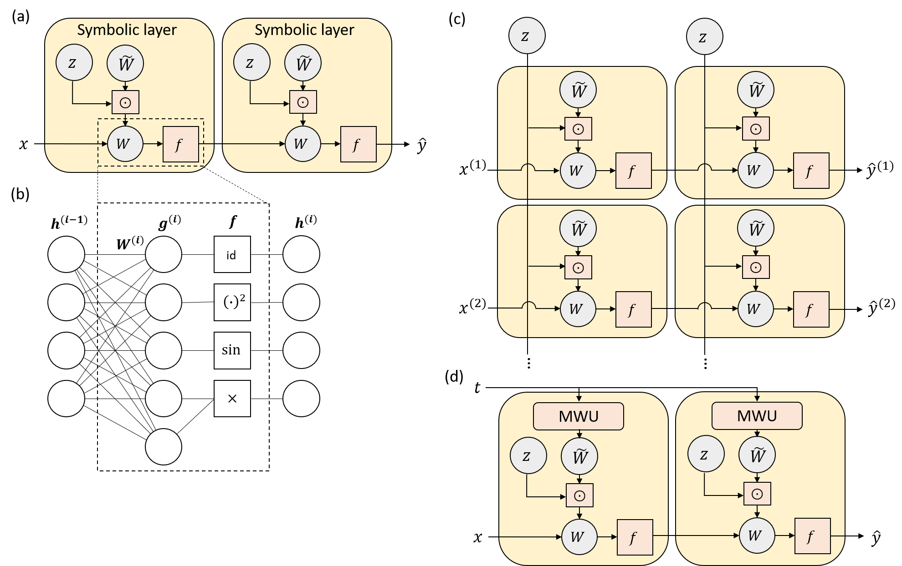

# Deep Learning and Symbolic Regression for Discovering Parametric Equations

This library is the official repository for the paper [Deep Learning and Symbolic Regression for Discovering Parametric Equations](https://arxiv.org/abs/2207.00529). 

## Citing

If you use any of this code, please cite:

```
@article{zhang2022deep,
  title={Deep learning and symbolic regression for discovering parametric equations},
  author={Zhang, Michael and Kim, Samuel and Lu, Peter Y and Solja{\v{c}}i{\'c}, Marin},
  journal={arXiv preprint arXiv:2207.00529},
  year={2022},
  doi={10.48550/ARXIV.2207.00529}
}
```

## Introduction

We introduce two variants of the EQuation Learner (EQL) neural network architecture
([Paper](https://ieeexplore.ieee.org/document/9180100), [GitHub repo](https://github.com/samuelkim314/DeepSymReg))
for performing symbolic regression on parametric equations where the structure of the equation remains constant but the
coefficients may vary.

The original EQL network resembles a fully-connected neural network, but the activation functions are replaced by the
primitive functions (e.g. addition, sine, multiplication).
The EQL network also uses sparsity regularization (smoothed L0 is used in this work) to incentivize most of the weights to be 0.
By training directly on a dataset, the EQL network learns the equation describing the dataset, which can be simply read off of the weights.
Because the EQL network is trained through backpropagation, it can be integrated with other deep learning architectures
to enable symbolic regression on high-dimensional datasets.

Here we proposed the Stacked EQL (SEQL) and the Hyper EQL (HEQL) architectures, shown in the Figure parts (c) and (d), respectively.
The SEQL architecture has a separate EQL network for each "time step" (the varying dimension), with shared L0 regularization to induce group sparsity.
The HEQL architecture has a meta-weight unit (MWU) that takes t as an input and outputs the weights of the EQL network, similar to a hypernetwork.




## Quick Start

The top-level files (`benchmark_{}_{}.py`) can be run after installing the necessary packages to replicate the experiments
presented in the paper.
These files generate data before running (files in `generate_data/`) so data does not need to be generated in advance.
Each `benchmark` file contains multiple benchmark functions and will run all of them, so comment out the ones you don't want to run.
The results for each benchmark function is saved in a separate folder, with the exception of `eq_summary.txt` which contains
the test MSE and learned equations for all of the benchmark functions.
This is for convenience of comparing performance at a glance.

## Code Outline

#### Architecture
- `utils/symbolic_network.py` contains code for the networks in the original EQL paper.
- `utils/para_sym_network.py` implements the HEQL and SEQL architectures.
- `utils/conv_sym_network.py` implements the networks containing convolutional encoder -> HEQL/SEQL.
- `utils/conv_relu_network.py` implements the network containing convolutional encoder -> FC ReLU layers.

#### Other
- `utils/functions.py` Wrapper classes for each of the activation/primitive functions to interface between TensorFlow and SymPy
- `utils/pretty_print.py` Takes the trained weights of the EQL/SEQL/HEQL network and prints out the learned equation with symbolic simplification.
- `utils/schedules.py` Learning rate and regularization weight schedules 

#### Experiments
- `generate_data/contr.py` contains code for generating parametric analytical expression data.
- `generate_data/addiff.py`, `generate_data/burgers.py`, and `generate_data/ks.py` contain code for generating data for the advection-diffusion equation, Burgers' equation, and the Kuramoto-Sivashinsky equation, respectively.
- `generate_data/conv.py` contains code for generating data for the convolutional tasks.
- The seven `benchmark_{}_{}.py` files run training and testing for the various experiments. They also save results in a specified results directory.

#### Data analysis and plotting
- `utils/plotters.py` defines a `Plotter` object for each experiment type that helps create the appropriate figures. See the comments in the file for specific information about what each function does/plots.
- `plot_results.py` plots all the necessary figures by instantiating and calling the `Plotter` objects defined by `utils/plotters.py`.

## Data analysis
Because the equation changes as a function of the varying dimension (e.g. time), we cannot print out a single learned equation after training.
However, we can print out the learned equation at a particular point in time.
The `benchmark` files print out the learned equations at 4 points in time in `eq_summary.txt`.
To get the full set of learned equations at every point in time, you can use `Plotter.get_expr_list()` in `utils/plotters.py`
(or equivalently, `Plotter.save_expr_list()` and `Plotter.load_expr_list()`).
Note that `Plotter.get_expr_list()` can take a long time to process the equations for all time steps, so I recommend using
`Plotter.save_expr_list()` once and then `Plotter.load_expr_list()` for all further processing.

Once the equations have been processed, the coefficients can be extracted as a function of time using `Plotter.get_coeffs()`.